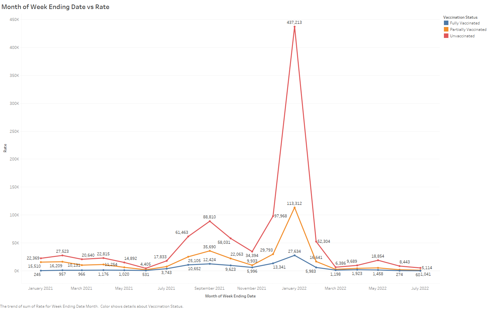
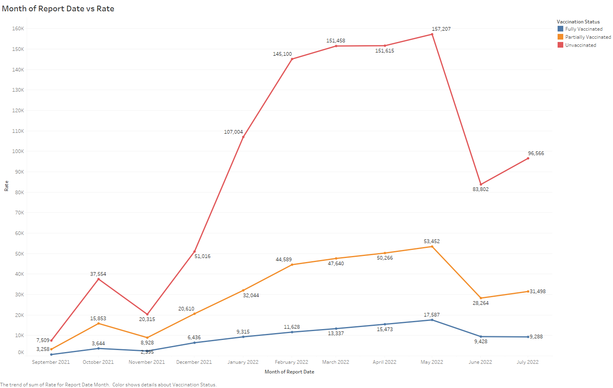
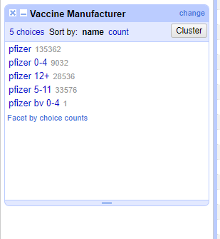
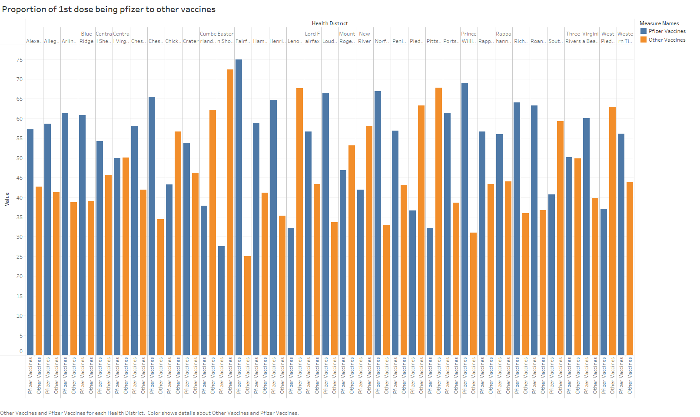
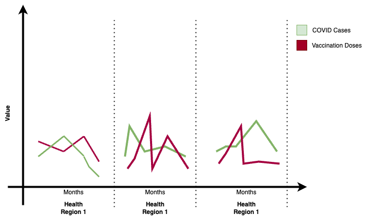
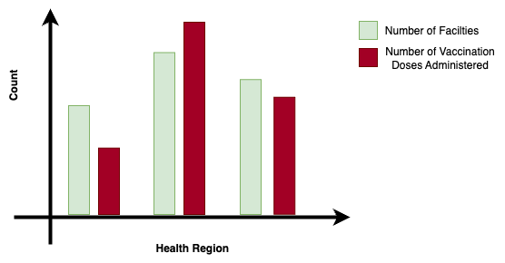

HW 4, CS 625, Spring 2022
================
Emmanuel Prem Kumar Gullipalli
Mar 02, 2023

## Part 1

**Q. Use dataset 1 to create a chart to answer the question, “How has
the weekly rate of COVID-19 cases in Virginia changed over time based on
vaccination status?”. (Though I’ll use cases here, you may show cases,
hospitalizations, or deaths.)**  

The dataset provided contains information on COVID-19 cases in various
locations in Virginia, including infections, deaths, and
hospitalizations. The data is sorted based on the vaccination status of
individuals, which is classified as “Fully Vaccinated,” “Partially
Vaccinated,” or “Unvaccinated.” The dataset also includes data on
different health regions, including the “Central Region,” “Eastern
Region,” “Northern Region,” “Northwest Region,” and “Southwest Region.”
To analyze the trend of COVID-19 cases in Virginia over time based on
vaccination status, the dataset needs to be cleaned first. OpenRefine is
used to clean the dataset, as indicated below.

##### Data cleaning using OpenRefine

  

We will first load the given dataset and choose to parse any number
value to number type instead of text type.

Then i choose edit cells for the Report Date column and selected common
transforms to convert into to date.Now, as per the requirements in the
question, the rate_per_100k needs to be calculated using the formula,
rate_per_100k = (cases / population_denominator) \* 100000.I have added
Rate column to the data by selecting edit column cells to add new column
named rate and using the below code:  
`round(((cells['Infections'].value + cells['Deaths'].value + cells['Hospitalizations'].value)/(cells['Population Denominator'].value * 1.0))* 100000)`  

This excel data is then exported and used in Tableau.

  
For plotting the required chart analyzing how the weekly rate of
COVID-19 cases in Virginia changed over time based on vaccination
status. In the given dataset *Report Date* and *Week Ending Date* are
ordinal attributes, and the *Health Region* and *Vaccination Status* are
Categorical Data, and *Overall Case Rate* is the quantitaive data that
we will be using for the visualization.  

For Month week ending date vs rate :

I have selected “Week ending date” table and dropped in columns section
and “rate” attribute in rows section.After that i have dropped
vaccination status table in color marks.

  
To visualize the given information, we will be using the *week ending
date*, and *Vaccination Status*. Since in this we have one quantitative
value attribute and one ordered key attribute, we will be using a line
chart. The categorical attribute of Vaccination Status will be used to
plot the multiple lines in the chart. In tableau, the column is *week
ending date* which is ordered across Month, Year and the row is
*Sum(Rate)*. The *Vaccination Status* is used for the multiline and the
channel used is Color. I also used Dots as marks for indicating the each
point on the line.  

For Month of report date vs rate:

I have selected “Report Date” table and dropped in columns section and
“rate” attribute in rows section.After that i have dropped vaccination
status table in color marks.

  
To visualize the given information, we will be using the *report date*,
and *Vaccination Status*. Since in this we have one quantitative value
attribute and one ordered key attribute, we will be using a line chart.
The categorical attribute of Vaccination Status will be used to plot the
multiple lines in the chart. In tableau, the column is *report date*
which is ordered across Month, Year and the row is *Sum(Rate)*. The
*Vaccination Status* is used for the multiline and the channel used is
Color. I also used Dots as marks for indicating the each point on the
line.  

##### Analysis of the Visualization

  

By using lines and dots as marks in the above graphs and color as the
channel we are able to comprehend the pattern in the cases for different
vaccination status over a period of time. In the chart one can analyze
that the cases are always the highest for Unvaccinated patients and the
lowest for Vaccinated patients. This means that the vaccination was
actually preventing the infection of Covid 19.  

## Part 2

**Q. For each health district in Virginia, what proportion of all 1st
doses were of the Pfizer vaccine?**  

The given dataset includes Administration Date, FIPS, Locality, Health
District, Facility Type, Vaccine Manufacturer and Dose Number. In order
to understand the the total number of 1st dose vaccines administered in
each health district based which are Pfizer, we must first clean the
data.  

#### Data cleaning using OpenRefine

We will first load the given dataset and choose to parse any number
value to number type instead of text type.

Firstly, I have selected “Health District” column and then i removed the
rows related to “Not Reported” and “Out of State” as only Virginia state
data is required.

Then, i have selected “dose number” column and removed all the rows
related to dose 2 to 6 as only dose 1 data is required.

Below is the screenshot of all doses data before cleaning:

Below is the screenshot of dose 1 data after cleaning:

After this i have cleaned pfizer vaccine data and named all the pfizer
name as same.

Below is the screenshot for pfizer data before cleaning:

Below is the screenshot for pfizer data after cleaning:

This data is now exported and used in tableau.

##### Data Processing

  

The information must be categorized into two groups. The first group
should be based on the Health District and the total count of
administered vaccine doses, while the second group should be based on
the Health District, the total count of administered vaccine doses, and
only include vaccines from the Pfizer manufacturer.  

The csv data is loaded using the pandas library. This data is first
grouped by ‘Health District’ and summed using ‘Vaccine Doses
Administered Count’.

  

    import pandas as pd
    vaccineData = pd.read_csv("CleanDataset2.csv")
    allGroupData = vaccineData.groupby(['Health District'])['Vaccine Doses Administered Count'].sum()
    print(allGroupData)

  

Then we need to extract data that have the ‘Vaccine Manufacturer’ as
‘pfizer’. This data is then again grouped in the same fashion as
above.  

    pfizerData = vaccineData[vaccineData['Vaccine Manufacturer'] == 'pfizer']
    pfizerGroupData = pfizerData.groupby(['Health District']).agg(pfizer_manufacturer=('Vaccine Doses Administered Count', 'sum')).reset_index()
    print(pfizerGroupData)

  
The two sets of data need to be linked together to obtain the total
number of vaccinations and the number of Pfizer vaccinations in each
Health district. This can be achieved using Python’s merge function.  

    finalMergedData = pd.merge(allGroupData, pfizerGroupData)
    finalMergedData['pfizer_propotion'] = (finalMergedData['pfizer_manufacturer'].astype(int) / finalMergedData['all_manufacturer'].astype(int)) * 100
    print(finalMergedData)
    finalMergedData.to_csv('MergedDataset2.csv')

This csv data is then used in Tableau. All the above code is executed in
the given Google Colab Notebook.

[Google Colab
Notebook](https://colab.research.google.com/drive/1MqtKtwCeE7qu0l7ZcmSY9SiUlDrSur7X?usp=sharing)

##### Data Information

  

Once the data has been processed, we can calculate the percentage of
vaccine doses that were administered by Pfizer and other manufacturers
in each Health district. We will then use Tableau to create a grouped or
side-by-side bar chart. The dataset includes Health District as a
categorical variable and the number of Pfizer and other vaccines
administered as quantitative variables, where the total of both will be
100%. As we have one categorical variable and one quantitative variable,
we can create a bar chart with multiple columns and then a stacked chart
to display the proportions.

  

For Proportion of 1st dose being pfizer to other vaccines :

The data has been uploaded to Tableau, we will begin by placing the
“Health District” variable in the Column section. Next, we will move the
“Measure Values” variable to the Rows section and select only “Pfizer
Vaccine” and “Other Vaccine”. We will then move the “Measure Names”
variable to the “Color” mark and select only “Pfizer Vaccine” and “Other
Vaccine” to create either a Side-by-Side Bar chart or a Grouped Bar
chart.

The Stacked Bar Chart provides an excellent visual representation of the
proportion of Pfizer vaccines compared to the total and the proportion
of other vaccines in each Health District. The chart uses bars as marks,
with color and height as the channels. By examining the chart, we can
conclude that the Health District “Fairfax” has the highest proportion
of Pfizer vaccines compared to any other Health District, while “Eastern
Shore” has the lowest proportion.

## Part 3

**Q. Propose two questions that require data from dataset 1 and dataset
2 to be combined to answer. Describe what data manipulation would need
to be done to answer each question. Sketch a chart that could be used
the answer each question. Justify your visualization idiom choice.**  

*Q1. How the total number of cases and vaccination doses are evolving
across various health regions over a particular duration of time.*

  

The first dataset provides data on the number of infections,
hospitalizations, and deaths reported in a specific region. The second
dataset provides data on the number of vaccinations, but only at the
level of Health Districts and Localities. It is important to note that
the regions in the first dataset are categorized as Health Regions,
which are the outermost region, containing Health Districts, which in
turn consist of Localities. In contrast, the second dataset only
provides information at the level of Health Districts and Localities.

  

To create this graph, we need to calculate the total number of cases
(Infections + Hospitalizations + Deaths) for each Health Region every
month, based on the first dataset. In the second dataset, we need to
analyze each Health District and assign it to its corresponding Health
Region, and then calculate the total number of vaccination doses for
each region every month. To visualize this data, we will create a
side-by-side multi-line chart.

An example chart is as shown below:

The multi-line chart provides insights into how the vaccination efforts
are reducing the number of COVID cases and how the vaccination doses are
distributed across different regions. It may also be useful to analyze
individual vaccine manufacturers to determine which vaccine is most
effective in reducing COVID cases.

  

*Q2. How the total number of cases and vaccination doses are fluctuating
across various health regions during a specific time frame.*

  

By using dataset1 and dataset2 to analyze the availability of Covid
Vaccines in different Health Regions. When we say “availability,” we are
referring to the number of vaccination facilities in each region and the
number of vaccination doses given by each facility. To obtain the
“Health Region” data, dataset2 needs to be processed using the “Health
District” information. Since the result would be a count of facilities
in each region, which includes one categorical data and two quantitative
data, a side-by-side bar chart would be a suitable solution. This method
allows us to compare the number of facilities in each region and
investigate any relationship between the number of facilities and the
number of vaccination doses administered.A sketch of the graph could be
as below:

  

## References

- Tableau Tutorial, <https://www.tutorialspoint.com/tableau/index.htm>
- Stacked Bar in Tableau,
  <https://hevodata.com/learn/stacked-bar-charts-in-tableau/>
- Creation of Group Chart,
  <https://kb.tableau.com/articles/howto/creation-of-a-grouped-bar-chart>
- Pandas Merge Function,
  <https://pandas.pydata.org/docs/reference/api/pandas.merge.html>
- Export Views in Tableau,
  <https://help.tableau.com/current/pro/desktop/en-us/save_export_image.htm>
